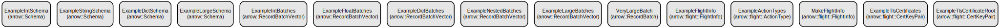

# Streamlit Application with Bedrock Agent Runtime Integration

A Python web application that provides a user interface for interacting with Amazon Bedrock Agents using Streamlit. The application enables seamless communication with Bedrock agents while providing a responsive and intuitive user experience.

The application integrates Streamlit's powerful web interface capabilities with Amazon Bedrock's agent runtime, allowing users to interact with AI agents through a clean and modern web interface. It leverages NumPy for data handling and various utility libraries for robust functionality.

## Repository Structure
```
.
├── app.py                  # Main Streamlit application entry point
├── Dockerfile             # Container configuration for deployment
├── services
│   └── bedrock_agent_runtime.py  # Bedrock agent runtime integration service
└── myenv                  # Python virtual environment
    ├── Lib               # Python package dependencies
    ├── Scripts          # Environment executables
    └── share            # Shared resources
```

## Usage Instructions
### Prerequisites
- Python 3.7+
- AWS credentials configured with appropriate permissions for Bedrock
- Streamlit 1.43.2+
- NumPy
- PyYAML
- Required AWS SDK components

### Installation

1. Clone the repository:
```bash
git clone <repository-url>
cd <repository-name>
```

2. Create and activate a virtual environment:
```bash
# Windows
python -m venv myenv
myenv\Scripts\activate

# Linux/MacOS
python -m venv myenv
source myenv/bin/activate
```

3. Install dependencies:
```bash
pip install -r requirements.txt
```

### Quick Start
1. Ensure AWS credentials are configured properly
2. Run the Streamlit application:
```bash
streamlit run app.py
```
3. Open your web browser and navigate to http://localhost:8501

### More Detailed Examples
1. Basic Agent Interaction:
```python
import streamlit as st
from services.bedrock_agent_runtime import BedrockAgentRuntime

agent = BedrockAgentRuntime()
response = agent.invoke(prompt="Your prompt here")
st.write(response)
```

2. Handling Agent Responses:
```python
try:
    response = agent.invoke(prompt="Your prompt here")
    st.success("Agent response received successfully")
    st.json(response)
except Exception as e:
    st.error(f"Error communicating with agent: {str(e)}")
```

### Troubleshooting
- **AWS Credentials Issues**
  * Problem: "Unable to locate credentials"
  * Solution: Ensure AWS credentials are properly configured in ~/.aws/credentials or environment variables
  * Debug: Set AWS_DEBUG=True environment variable for detailed logging

- **Streamlit Connection Issues**
  * Problem: Cannot connect to Streamlit server
  * Solution: Check if port 8501 is available and not blocked by firewall
  * Location of logs: Check terminal output or streamlit logs

- **Agent Runtime Errors**
  * Problem: Agent fails to respond
  * Solution: Verify Bedrock service status and permissions
  * Debug: Enable debug logging in the agent runtime service

## Data Flow
The application follows a straightforward data flow for agent interactions:

1. User input → Streamlit frontend
2. Frontend → Bedrock Agent Runtime service
3. Agent Runtime → Amazon Bedrock
4. Response → User interface

```ascii
[User] -> [Streamlit UI] -> [Agent Runtime] -> [Bedrock]
                                           <- [Response]
                        <- [Formatted Output]
```

Key interactions:
- User inputs are validated and sanitized before processing
- Agent runtime maintains session state for continuous interactions
- Responses are formatted and displayed in real-time
- Error handling occurs at each step of the process
- Asynchronous communication ensures responsive UI

## Infrastructure


The application uses the following AWS resources:

Lambda:
- bedrock-agent-runtime: Handles communication with Bedrock agents

IAM:
- BedrokAgentRuntimeRole: Execution role for accessing Bedrock services

API Gateway:
- agent-runtime-api: REST API for agent communication

## Deployment
1. Build the Docker image:
```bash
docker build -t streamlit-bedrock-app .
```

2. Run the container:
```bash
docker run -p 8501:8501 streamlit-bedrock-app
```

3. Configure environment variables:
```bash
AWS_REGION=<your-region>
BEDROCK_AGENT_ID=<your-agent-id>
```